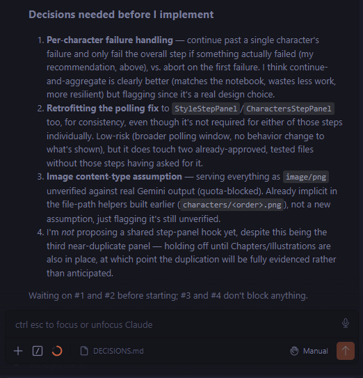

<!-- DECISION 1 -->

## Uploaded-file detection in `parseCreateProjectForm`

**My decision:** Use `instanceof File` because the application expects an actual uploaded `File`, making the check explicit and type-safe.

**Claude's decision:** Replace `instanceof File` with a property-based check (`name`, `size`, and `text()`) to handle possible differences between `File` implementations across environments.

**Difference:** Claude prioritized cross-runtime compatibility, while my approach prioritizes checking for the actual `File` type expected by the application.

**Final decision:** Keep `instanceof File`. The cross-runtime concern is relevant for tests, but changing production code to accept arbitrary file-like objects is unnecessary unless the application actually needs to support those runtimes.

**Recorded in:** `3a8d429` — "test: improve project, auth, and pipeline coverage" (2026-08-11).

<!-- DECISION 2 -->

## Polling for running pipeline steps

**My decision:** Only change the polling behavior where it is needed for Portraits. Do not change the already working Style and Characters panels just for consistency.

**Claude's decision:** Claude proposed changing the polling behavior in all five step panels by using `isSubmitting || isRunning` instead of only `isRunning`.

**Difference:** Claude wanted one common fix across all panels. I prefer a smaller change because Portraits is the step that actually needs live per-character progress.

**Final decision:** Update the Portraits panel to poll while its request is running. Keep Style and Characters unchanged unless testing shows they have the same problem.

**Recorded in:** `6797906` — "feat: add portrait generation panel" (2026-08-12).

<!-- DECISION 3 -->

## Image file type

**My decision:** Do not assume every Gemini image is PNG.

**Claude's decision:** Claude planned to save all images as `.png` and return `image/png`.

**Difference:** Claude's approach is simpler, but it assumes Gemini always returns PNG.

**Final decision:** Check the image type from Gemini and make sure the saved file and response use the correct type.

**Recorded in:** `b32bc06` — "fix: preserve Gemini image MIME types" (2026-08-12).

